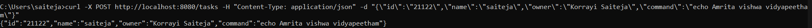
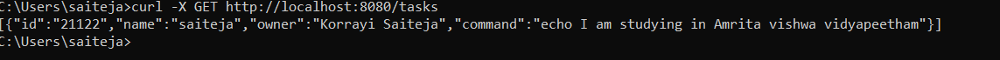
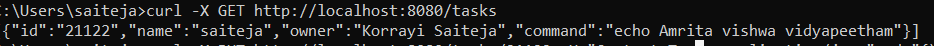
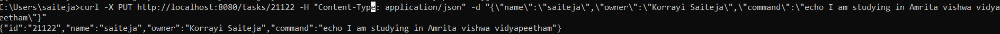
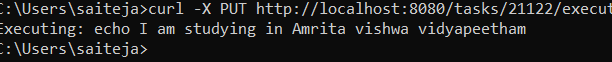

# Spring Boot Task API 🚀

This is a **Spring Boot REST API** that allows users to create, update, and execute tasks.

## Features 🌟

- Create a task ✅
- Update a task 🔄
- Execute a task ⚡
- Delete a task ❌

---

## 📌 Installation

1. Clone the repository:

```sh
 git clone <your-repo-url>
```

2. Navigate to the project folder:

```sh
 cd TaskApi
```

3. Build the project:

```sh
 mvn clean install
```

4. Run the application:

```sh
 mvn spring-boot:run
```

---

## 🛠 API Endpoints

### 1️⃣ **Create a Task**

```sh
curl -X POST http://localhost:8080/tasks -H "Content-Type: application/json" -d '{"id":"21122","name":"saiteja","owner":"Korrayi Saiteja","command":"echo Amrita vishwa vidyapeetham"}'
```


### 2️⃣ **Get All Tasks**

```sh
curl -X GET http://localhost:8080/tasks
```


### 3️⃣ **Get a Task by ID**

```sh
curl -X GET http://localhost:8080/tasks/21122
```


### 4️⃣ **Update a Task**

```sh
curl -X PUT http://localhost:8080/tasks/21122 -H "Content-Type: application/json" -d '{"id":"21122","name":"saiteja","owner":"Korrayi Saiteja","command":"echo I am studying in Amrita Vishwa Vidyapeetham"}'
```


### 5️⃣ **Execute a Task**

```sh
curl -X PUT http://localhost:8080/tasks/21122/execute
```


### 6️⃣ **Delete a Task**

```sh
curl -X DELETE http://localhost:8080/tasks/21122
```


---


## 📸 Screenshots

All screenshots are stored in the images directory.

- [Create Task](TaskApi/images/post.png)
- [Get All Tasks](TaskApi/images/listalltasks.png)
- [Get Task by ID](TaskApi/images/get.png)
- [Update Task](TaskApi/images/update.png)
- [Execute Task](TaskApi/images/execute.png)
- [Delete Task](TaskApi/images/delete.png)

---

## 📌 Technologies Used

- **Spring Boot**
- **MongoDB**
- **Maven**

